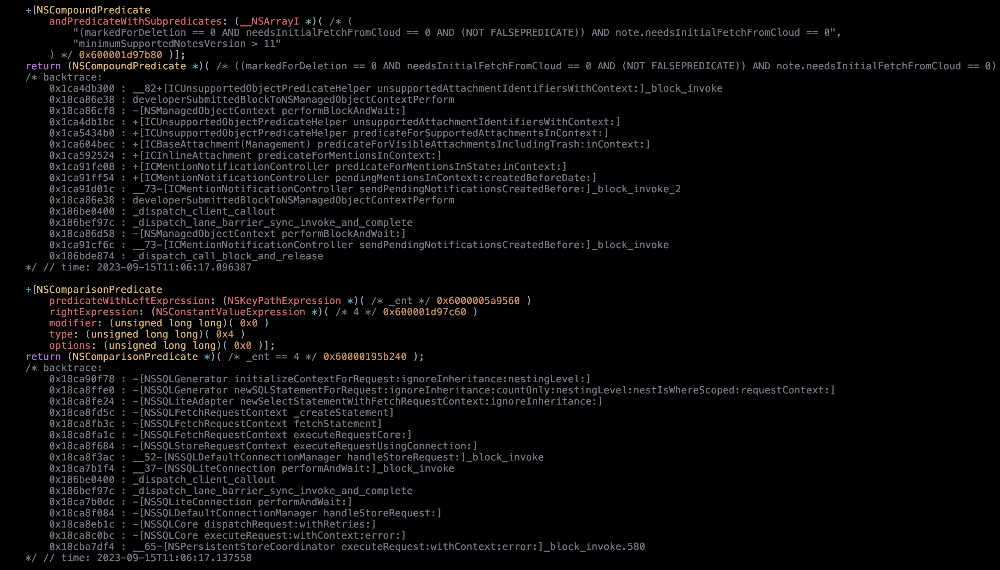

# funtime

`funtime` is an Objective-C runtime tracing tool made with frida

## Usage 

```
$ funtime -h
usage: funtime [-h] [-s] [-U] [-b] -n NAME [-t THEME] [-c BGCOLOR] [-l SCRIPT] SEL [SEL ...]

funtime: Objective-C runtime tracing

positional arguments:
  SEL                   a method selector like "*[NSMutable* initWith*]"

optional arguments:
  -h, --help            show this help message and exit
  -s, --spawn           spawn process
  -U, --usb             use usb device
  -b, --backtrace       display backtrace (slow)
  -n NAME, --name NAME  name of process or pid
  -t THEME, --theme THEME
                        display theme
  -c BGCOLOR, --bgcolor BGCOLOR
                        background color
  -l SCRIPT, --script SCRIPT
                        load an additional script
```

## Example
Output from `funtime -n Notes -b '+[NSPredicate *]'`:

